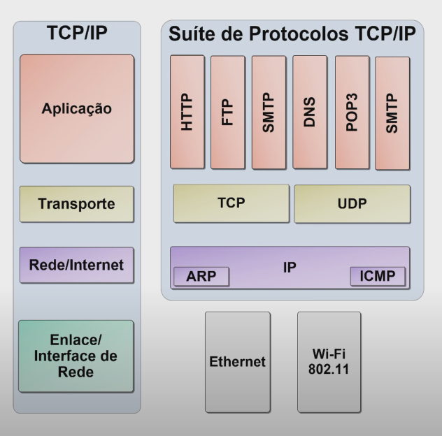

# Guia Básico de Redes       

## TCP/IP

      HTTP  : Transferência de páginas
      HTTPS : Transferências de páginas não seguras
      FTP   : Transferência de arquivos
    
      Serviços de correios eletrônicos:
           SMTP  : Enviar mensagens de email
           POP3  : Receber mensagens de email
           IMAP  : Acessa mensagens no servidor
           
      TELNET: Acesso remoto a um host
      DNS   : Conversão de nomes de domínios em endereços IP
      TCP   : Protocolo de contole de transmissão Cliente e Servidor 
      UDP: Portocolo que não é voltado para conexão (*Sem Conexão, *Não confiável)
      DHCP: protocolo de distribuição de endereços IPs

## Portas padrões dos protocolos

       HTTP  : 80
       HTTPS : 443
       POP3  : 110
       SMTP  : 25
       FTP   : 20 e 21
       DNS   : 53
       IMAP  : 143
       TELNET: 23
       SSH   : 22

